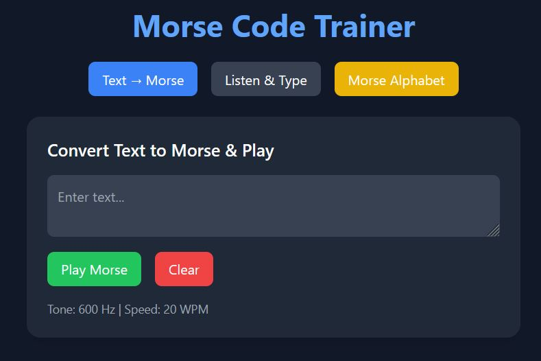

# 9M2PJU Morse Code Trainer

A modern, responsive, and interactive Morse code trainer for learners, amateur radio operators, and hobbyists — built using **HTML**, **Tailwind CSS**, and **Vanilla JavaScript**.

> 🛠️ **Forked and enhanced from the original project by [genemecija](https://github.com/genemecija/learn-morse-code)**  
> 🎖️ Credit and special thanks for the foundation and original functionality.

---

## 🚀 Features

- **Text → Morse Converter**  
  Type any message and play it back using real Morse tones generated via the Web Audio API.

- **Practice Mode**  
  Listen to randomly selected words in Morse code and type what you hear — helps improve decoding skills and recognition.

- **Interactive Morse Alphabet**  
  Open a modal to view the full Morse code reference chart for letters, numbers, and symbols.

- **Web Audio API**  
  Generates accurate audio tones for dots and dashes in real time.

- **Responsive UI**  
  Clean, mobile-friendly design using Tailwind CSS.

---

## ✨ New Enhancements by 9M2PJU

These are the key improvements made on top of the original version:

- 🎛️ **Tone Frequency Slider** – Adjust tone frequency (Hz) in real time.
- ⏱️ **Speed (WPM) Slider** – Customize Morse transmission speed (words per minute).
- 🔊 Improved audio feedback and real-time value display.
- 💡 Cleaner UI layout with improved readability and dark-mode readiness.
- 🧼 Refactored and simplified the HTML/JS structure for easier maintenance.
- 🌐 Hosted at: [https://morse.hamradio.my](https://morse.hamradio.my)

---

## 📖 How to Use

### 🔡 Text → Morse

1. Type your message in the **text box**.
2. Click **Play Morse** to hear it in Morse code.
3. Use the sliders to adjust **tone** and **WPM** speed.
4. Press **Clear** to reset.

### 🎧 Practice Mode

1. Click **Start Practice**.
2. A random word will play in Morse code.
3. Type what you heard into the input box.
4. Receive immediate feedback when correct.

### 📘 Morse Alphabet Chart

- Click **Morse Alphabet** to view a full Morse reference.
- Tap any letter/number to hear the tone.

---

## 🛠️ Tech Stack

- **HTML5**
- **Tailwind CSS**
- **JavaScript (Vanilla)**
- **Web Audio API**

---

## 👤 Target Audience

- HAM radio operators
- Students learning Morse code
- CW contest trainees
- Enthusiasts of telegraphy and radio communications history

---

## 📸 Screenshot

---

## 🔗 Live Demo

🌐 [https://morse.hamradio.my](https://morse.hamradio.my)

---

## 📜 License

MIT License © 2025 [9M2PJU](https://github.com/9M2PJU)

Based on original work by [genemecija](https://github.com/genemecija/learn-morse-code)
