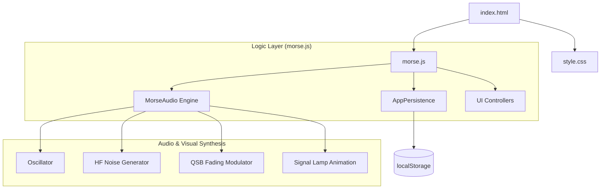
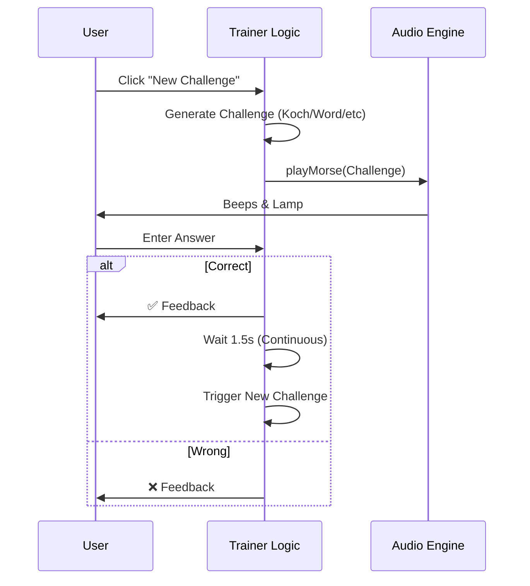

# 9M2PJU Morse Code Lab

**9M2PJU Morse Code Lab** is a professional Morse and CW practice console with encoding, decoding, Koch learning, contest copy, audio decode, and offline install support. It is built as a high-performance static web app for amateur radio operators and CW enthusiasts.

🔗 **Live Demo:** [https://morse.hamradio.my](https://morse.hamradio.my)


[](https://github.com/9M2PJU/9M2PJU-Morse-Code-Trainer/stargazers)
[](https://github.com/9M2PJU/9M2PJU-Morse-Code-Trainer/network)
[](https://github.com/9M2PJU/9M2PJU-Morse-Code-Trainer/commits/main)
[](https://github.com/9M2PJU/9M2PJU-Morse-Code-Trainer)
[](LICENSE)

### 📊 Project Stats

| Metric | Value |
|--------|-------|
| Total Lines of Code | ~3,700 |
| Dependencies | **Zero** — pure vanilla JS |
| Core Files | 3 (`index.html`, `style.css`, `morse.js`) |
| Total Size | ~131 KB (uncompressed) |
| Browser Support | All modern browsers (Chrome, Firefox, Safari, Edge) |

---

## 🏗 Project Architecture


```mermaid
graph TD
    A[index.html] --> B[style.css]
    A --> C[morse.js]
    
    subgraph "Logic Layer (morse.js)"
        C --> D[MorseAudio Engine]
        C --> E[AppPersistence]
        C --> F[UI Controllers]
    end
    
    subgraph "Audio & Visual Synthesis"
        D --> G[Oscillator]
        D --> H[HF Noise Generator]
        D --> I[QSB Fading Modulator]
        D --> K[Signal Lamp Animation]
    end
    
    E --> J[(localStorage)]
```

---

## ✨ Features

### 🔤 Encoder & Decoder
- **Real-time Conversion**: Instant Text ↔ Morse translation.
- **Audio Synthesis**: High-fidelity sine wave generation with smooth envelopes.
- **Visual Signal Lamp**: High-visibility real-time lamp sync for all playback modes.

### 🔦 Visual Morse
- **Visual Encoder**: Dedicated "Signal Lamp" mode for maritime signaling practice.
- **Visual Decoder**: Interactive trainer to master receiving visual Morse pulses.
- **Mute Toggle**: Sound off by default — lamp-only mode for silent practice. Enable audio with one click.

### 🎓 Advanced Trainer (Practice Mode)
- **Continuous Mode**: Auto-advance to the next challenge after a correct answer (1.5s delay).
- **8 Difficulty Levels**:
  - **Koch Method** (progressive five-character copy groups)
  - **Letters, Numbers, Mixed**
  - **Common Words** (CW shorthand)
  - **Callsigns** (Realistic prefixes/suffixes)
  - **Prosigns** (BT, AR, SK, etc.)
  - **Abbreviations** (RST, QTH, 73, etc.)
- **Koch Method**: Progressive character learning (Levels 1–40), highlighted new characters, saved session accuracy, and one-click lesson promotion.
- **Farnsworth Timing**: Decouple character speed from overall WPM to master instant recognition.

### 📱 Installable PWA
- **Offline Practice**: Core files are cached by a service worker after first load.
- **Install Button**: Supported browsers show an install action in the header.
- **App Manifest**: Standalone display, theme colors, shortcuts, and app icons for desktop/mobile install surfaces.

### 🏆 Contest Trainer
- **QSO Simulation**: Practice logging Callsigns, RST, and Exchange data.
- **Atmospheric Realism**:
  - **HF Noise**: Adjustable background static.
  - **QSB (Fading)**: Simulated ionospheric signal drifting.
- **Continuous Mode**: Rapid-fire contest simulation.

### 🎙 Audio Morse Decoder
- **Microphone Input**: Real-time Morse decoding from audio via the Goertzel algorithm.
- **Waveform Visualization**: Live audio waveform display with glow effects.
- **Auto-Calibration**: Automatic dot/dash duration calibration from incoming signal.
- **Tunable Detection**: Adjustable target frequency and detection threshold.

### ⚙️ Professional UX
- **Localized Settings**: No more tab-switching! Every panel has its own speed and frequency controls.
- **Persistence**: All settings and scores are saved automatically via `localStorage`.
- **Reference Chart**: Collapsible Morse Code Reference Chart always accessible at the bottom of the page.
- **Keyboard Shortcuts**: Ctrl+1 through Ctrl+7 for quick tab switching.
- **Professional Brand System**: Graphite workbench surfaces, teal signal accents, amber lesson highlights, and a custom 9M2PJU Morse Code Lab logo.

---

## 🛠 Tech Stack

- **Core**: Vanilla HTML5/CSS3/JS (Zero dependencies, incredibly fast).
- **Audio**: Web Audio API for custom synthesis and real-time gain modulation.
- **Design**: Professional graphite console theme with custom PWA branding assets.

---

## 🚀 Getting Started

```bash
# Clone the repository
git clone https://github.com/9M2PJU/9M2PJU-Morse-Code-Trainer.git
cd 9M2PJU-Morse-Code-Trainer

# Open directly or serve
python3 -m http.server 8000
```

---

## 📈 Trainer Logic Flow


```mermaid
sequenceDiagram
    participant U as User
    participant T as Trainer Logic
    participant A as Audio Engine
    
    U->>T: Click "New Challenge"
    T->>T: Generate Challenge (Koch/Word/etc)
    T->>A: playMorse(Challenge)
    A->>U: Beeps & Lamp
    U->>T: Enter Answer
    alt Correct
        T->>U: ✅ Feedback
        T->>T: Wait 1.5s (Continuous)
        T->>T: Trigger New Challenge
    else Wrong
        T->>U: ❌ Feedback
    end
```

---

## 👨‍💻 Author

**9M2PJU** — Amateur Radio Operator  
[HamRadio.my](https://hamradio.my) | [GitHub](https://github.com/9M2PJU)

---

## 📄 License

MIT License. See [LICENSE](LICENSE) for details.
